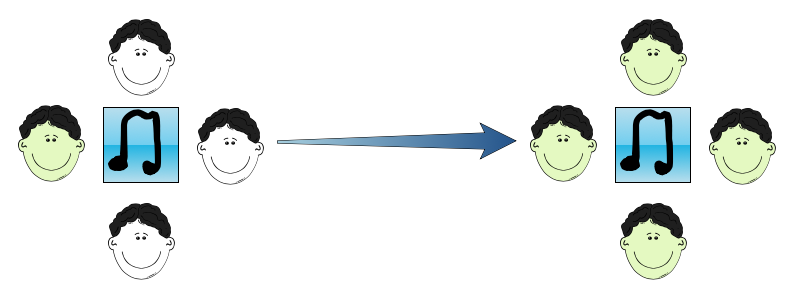
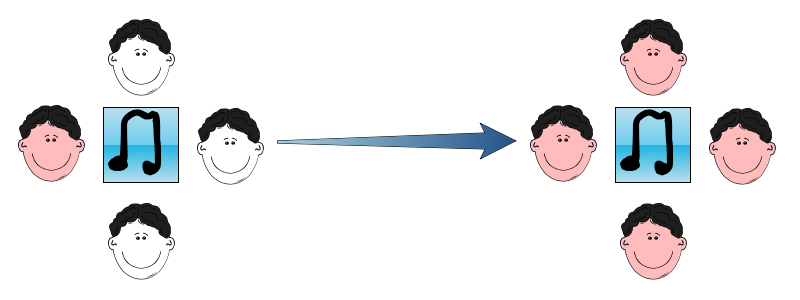
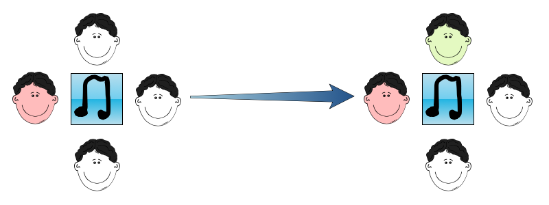
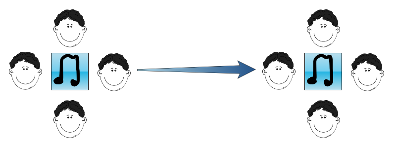

## Log: April 11

### Summary
This is the first time I've written anything on the project ever since we had to leave the school. 
Unfortunately, I haven't dedicated nearly as much time as I would have liked to when working on syd.
However I have decided on a number of design choices to help me down-scale.

### Julia 1.4 Shenanigans

Last week I finally took the time to update from 1.3. Oddly it refused to work until someone on the Julia Discourse suggested directly launching from the terminal (which had been problematic for me on 1.3). 
Yet after one launch the application and all just worked fine.

### Social Behaviour

Over the past few weeks I've been thinking about what makes the current music recommendation systems fail. 

Generally the more obnoxious and "in-your-face" ones pick a limited set of songs from modern artists and leave the user 
wondering how much this decision was based on their interests and how much on the software's. 
On the other side of the spectrum, we have recommenders which suggest a number of different playlists, giving the user
some form of choice in what they'd like to listen to from the list of recommendations.

Yet neither of these, in my opinion at least, work especially well and the user will generally come to accept this if they continue to use whichever app this recommender comes bundled with.

So I turned to the real world. People might recommend each other songs while chatting face to face or on forums, but the way I get most of my recommendations is a bit different.
Every once in a while I meet with a few of my friends and we listen to songs together. Thus in a sense, we each function as recommender to the other friends in the group. I feel that this is the most "human" context syd would work best in.

To explain why I'd like to design something based on this, I'd like to present a few diagrams [which I made using Sketch.io](https://sketch.io/sketchpad/).

A member in the group will search for a song (whether they've actually listened to it or not) and then the group will fall silent and listen. When the song is over they might ask how the rest of us liked it. Once someone has said that they liked it, the rest of the group might follow up by commenting what they liked about it.

However, sometimes the first to talk will say they don't like the song (most often when we're trying pranking one another) and try to skip it. The rest of the crowd will catch up to the joke soon after.

Less often, the crowd won't agree with the first to talk. The second to talk might defend the song if the first praised it, or vice versa. Interestingly, when this happens the remaining people are less likely to talk, keeping their thoughts to themselves.   

And sometimes, maybe if everyone's tired, no one will talk and we'll just move on to the next song. In this case everyone keeps their opinion to theirself and they're minimally influenced by the others.

### syd's Behaviour

Keeping the emphasis on ambiguity in tact, I want to be able to model the above mentioned group behaviour.

Since (at least at this stage), syd is meant for personal use, the "group" is only the user and syd. I figure, the trick to keep syd's mind distinct from that of the user is to ensure that there will be times when they are both silent (or at least the user isn't talking to syd directly). 

Until syd can learn the user's "taste", it could act passively. As the user picks their first songs it will have effectively suggested them to syd. This is equivalent to the first scenario, where someone who likes the song, influences the other members of the group. As time goes on the user and syd might talk less frequently from time to time, this is similar to the fourth scenario, which allows the individuals (both syd and the user) to develop their own opinions on the song, and eventually their own taste. 

What I'm concerned about is modeling the 2nd and 3rd scenarios. I am considering giving the user an unnatural priority in deciding what is "unpleasent" for the crowd over syd itself. That is to say, if the user says they don't like a song (regardless if they picked it or syd) syd will take this to heart and reconsider its choices in recommendation. Although it might detract from the realism of the model I gave with friends, it might be more close to that of a parent and child, or an older sibling and younger one where one tries to teach the other about music.

Thus, I now have a loose method on how to obtain "personally-customized" personalities for syd, even when starting right out of the box.

### Decision Modelling Process

Initially I wanted syd to be able to listen to the full song to be able extract information to the extent of a human, yet due to time constraints I've finally decided to base feature extraction mostly on what can be obtained from song metadata (artist, year, genre etc.). I'm not quite sure which music database to extract this information 
from for the time being, as it will mainly depend on what I can get to work.  

I plan to use a group of one-class KNN or SVM models to act as "seperators" to decide if a song matches up well with an emotion or not. So there could be an SVM for happiness, and another for sadness etc.

I think I will handle emotion transitions by using a series of HMM's, though I still have yet to decide on the full list of emotions to use (or to what extent these HMM's should be pre-trained).

### Music Database
Although I had considered Spotify before, I've turned my eye to SoundCloud. The API is both more accessible, afordable and I fell that it will help a lot more to the ambiguity factor, owing to the vast number of covers and remixes of songs. 
There however now arises the issue of matching covers, misnamed songs etc. to their respective release versions in whichever database I end up using, or the question of what to do if a song has multiple versions. 

### Julia and the Web 
While afraid that I might need to turn to python for the interface or API requests I was fortunate to discover [https://github.com/genieframework/Genie.jl](https://github.com/genieframework/Genie.jl) recently which seems to offer a variety of tools for web development.
