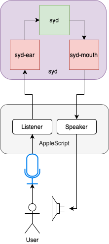
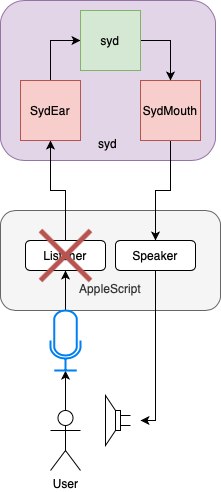

## Log: April 15

### Summary

Began the process of organized my messy notebooks and research into a runnable project, spent a lot of time trying to resolve the issue of speech recognition.

### The State of Speech Recognition and Julia

Despite having a plethora of Machine Learning and AI related packages, Julia falls short when it comes to speech recognition. That isn't to say that there aren't any workable libraries, in fact there are a couple of [WaveNet](https://github.com/r3tex/Wave.jl) implementations for _training_, but no real packages which come pre-trained. 

A suggestion I received was to [carry over weights from a python project](https://github.com/buriburisuri/speech-to-text-wavenet), but that would still take some fiddling around. 

In the end, I decided that I would use a temporary solution for now, so I could focus on the core aspects of the project. 

### Putting It Together

From what I could piece together from my messy notebooks, I designed a base to work off of: 

In this prototype version, syd has two modules, besides the main one `syd`, named `sydEar` and `sydMouth` respectively. As can be deduced from the name, they're in charge of handling "listening" and "speaking".

My temporary solution was to delegate the reponsiblity of text-to-speech and spech-to-text conversion to native MacOS features, to be called from Applescript files. I'd gotten the idea from seeing my father use dictation to write something the day before. 

### Makeshift Speech Recognition using MacOS Dictation

The `Speaker` worked very well, I have the option of choosing several pre-installed voices, and I chose the classical Daniel (slightly less mechanical than the default espeak had to offer).

The `Listener` on the other hand was quite a challange. Not only was it a lot less straightforward that you had to make a call to an application called  `SpeechRecognitionServer`, but furthermore it's my understanding that for whatever reason it was silently discontinued in Catalina (the version I'm on) and any attempts to access it gives an error.

Cut off from this original idea I had to look elsewhere...