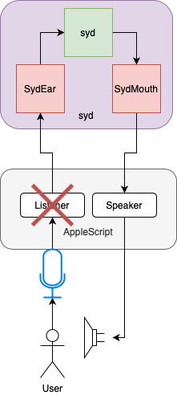
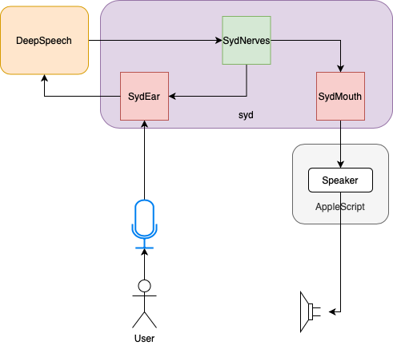

## Log: April 16

### Summary
Today was perhaps the single most productive day since I've started to project. I probably covered a lot of the stuff that would've been long done in the first 1-2 weeks had the current situation not occured, in only the span of a single day.

### Turning Back To DeepSpeech

It's midnight, and it looks like I'm not getting anywhere.

Insistent on not using an online API at all costs, I decided to install the MacOS Command-Line Client for [DeepSpeech](https://github.com/mozilla/DeepSpeech). It might not have the highest accuracy, but it was certainly the best choice for me in terms of balancing speed, accuracy and online/offline accessability. 

Installation wasn't as straightforward as I'd anticipated so I suggested [a couple](https://github.com/mozilla/DeepSpeech/pull/2909) [of edits](https://github.com/mozilla/DeepSpeech/pull/2910)for the documentation.

### A Talking [Cat](https://esolangs.org/wiki/Cat)

For my milestone of the day, I decided to make syd loop by talking back whenever it heard anything. To be more specific the goal was to first perform speech-to-text conversion and then follow it up with text-to-speech conversion.

In this new version of the prototype I introduce the `SydNerves` module. Giving the main `syd.jl` more of a background role focussed on application logic, I will be using this module to analyze text which has been obtained by transcribing recordings using `DeepSpeech`. But for now, it only sends a signal to `SydMouth` to speak the text aloud.

I'm glad to say I ended the day having completed this phase, unlike yesterday.

### The Secret to Spotify's Success?

Another half of my time today was devoted to reconsideration of how to handle the task of playing music. A few days ago I'd made a decision to switch to Souncloud, but much to my surprise they were in shambles. The API currently disallows generating new access tokens, except for previous developers. Even more surprisingly, this seems to have been the case for several months and I was surprised almost no one had complained about this on the internet.

Next I looked through BandCamp, which *did* have an API but was mostly limited to tracking profile information rather than streaming. YouTube / Apple Music both had rate limits to worry about so I distanced myself from those...

At this point I think it hit me! The secret to Spotify's success was not merely a result of shrewd business practices, succesful management, a competence to wrestle with the law and a domination of international markets. What makes, and continues to make, Spotify unique from almost all of its competitors is that it is very **integrable**. It's so integrable that it almost connects automatically to certain platforms such as Patreon or Discord. 

This leads me to believe that by being so easy to connect to, they've ensured that everyone is connected to Spotify. It's a go-to choice for developers beyond merely customers, artists and producers. And by controlling the developer market, they've been able to expand their outreach even further in those three other categories. Even if people never launch the Spotify app, there are enough websites out there using Spotify that they are likely to visit a website or two with Spotify integration (in one way or another) every day.

### And Yet...

It might seem strange that despite all of this praise that I am still refusing to turn back to Spotify. My main concern is the limited choice in songs and streaming (30 sec. previews are the best I can do to play a song on a non-mobile device as far as I can tell). While this **could** be satisfactory for an app which *strictly* recomends music with the user having to play it themselves, I feel that this is a bad trade-off for immersion.

I have some alternative solutions in mind, but for this week I think I will use my own songs which I'll add into the project directory. I'm hoping to save time so I can work on processing the text received from `SydEar` and `DeepSpeech` to get simple commands such as `Play` and `Pause` working.

