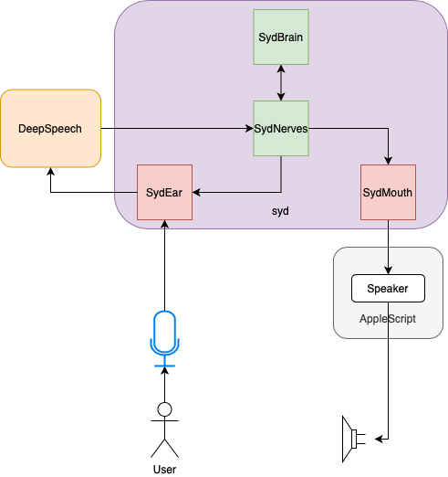
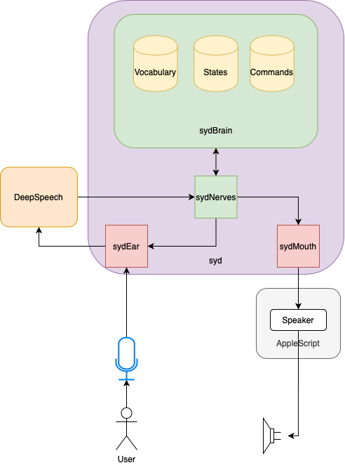

## Log: April 17

### Summary

Today was a long day, as it took me a few days afterwards to finish collecting my notes into a thorough log. I'm glad to report I've added in enough functionality to control a music player on one's own computer with voice commands, though with quite a few limitations. If anything it was more about getting to see what the minimum requirements for syd to actually work were.

### SydBrain

In order to facilitate the "comprehension" of speech syd had heard, I've designated a new module aptly called SydBrain. 

Text which arrives from SydEar will be parsed here to determine what the user means and an appropriate signal will be dispatched to the relevant action. To keep things simple, I decided to start by recognizing the word PLAY.

### Recognizing the word "Play"

Speech to Text conversion is a difficult task, so much that it's not even 100% accurate for us humans. What I'm using right now, DeepSpeech is pretty good, but it does sometimes add in extra letters or confuse words.

So I developed a workaround based on Levenshtein distance between a specific word (ex. PLAY) and substrings of the text. The goal isn't to search for perfect matches, in fact I've padded in dummy letters (ex. \*\*PLAY\*\*) to be able to capture extra letters (ex. SPLAY, PLAYE etc.).

### Recognizing more than one word

For now the process is to iterate over the text, mark words which have been recognized from the vocabulary list in upper-case and to repeat this for entire vocabulary set. 

In the future it's probably best to only consider "possible" words (ex. no need to search for "xylophone" in a sentence that looks like "She sells seashells by the seashore"). One way to achieve this could be to reverse the process so we iterate over windows in the sentence and compare to the vocabulary.  

### Final Comments on VOWELS 

Although extra letters are good for capturing consonant clusters, vowel mutations seem to require a different approach (play / plain, hey / hay etc.). This will require further investigation.

### A Bigger Brain

Now that we have a method, sub-optimal or not, it's time to better define the structure for sydBrain. 

#### Vocabulary
As stated above, words are kept in a vocabulary set. Right now this vocabulary set also defines the "tolerance" for each word (how many letters, before or after still qualify, internal changes etc. ).

#### States
States represent syd's machine/emotional state (and will likely be split into two in the future). There's no point in "pausing" if no music is playing, the purpose of these states is to build the necessary context for syd to know what it has to do. 

#### Commands
Although syd is (at least ideally) intended to perform dialogues, currently I'm planning on listing commands as distinct "reflexes". The idea here is to match a *word* from the vocabulary and a *state* from the available states, with an *action* to be executed by the *command*.

### More information on States

- startUp
    + initial state, mostly used for alerting the user that syd has launched.
- idle
    + syd isn't doing anything right now, his next action depends on what command the user gives.
- playingSong
    + syd is playing a song. The user might pause/stop the song.
- pausedSong
    + syd has paused a song. The user might play/stop the song.

### More information on Commands

Until I've better organized the file hierarchy I've hard-coded in the commands myself. Right now there are commands for PLAY, PAUSE and STOP.

### Dialogue

syd can now recognize a few greetings and say "Oh hey" back, while it's in the *idle* state. 

### syd, the "blind" DJ

Yesterday I complained about how inaccessible most music streaming services were. Today, I found a very make-shift solution. I decided to link the PLAY, PAUSE, STOP commands to the built-in Music (formerly iTunes) app. 

Right now, syd can't really *see* what song is playing, but adding this in shouldn't be too difficult. I might later switch to the Spotify app but an issue remains, this won't allow for the discovery of new songs. I look at this as a temporary solution, but a big step since I can now get some interactivity out of syd.

This concludes syd v0.0.2: Bare Bones Edition...

### What to Expect from v0.1.0

In version 0.1.0, I plan to make a lot of additions to focus on configurability and scalability.

#### Convert to a Genie Project

I had previously mentioned [Genie](https://www.genieframework.com) in a previous log entry. Similar to Django for Python, it's a web framework with a lot of nice utility features.

I want to keep syd a "locallly running project" instead of a web-app, so for my purposes it'll mostly be used for rendering the UI, and making HTTP requests. 

I don't know if I'll ever allow for "sharing" syd, between two or more people so that the they form a group together, but working with Genie will at least give me the option to consider this in the future.

Most importantly I'll take this time to make syd into a proper project and remove the requirement of having to run it from inside the `src/` directory.

#### Plug-and-Play text-to-speech/speech-to-text options

From the start, I've wanted syd to be all about configurability. Seeing as how a lot of the components I'm using are system-dependent, I think I've moved into a phase where I need to make these detachable/replaceable. 

There'll likely be something similar to a *Formulas* directory with *Builtins* added by me, mostly enough to ensure demos run correctly, and *Addons* which users can add in themselves.

#### Tidier File Hiearchy

The responsibilities of the modules have become slightly convoluted, mostly owing to the difficulty of implementing Commands. I had to hardcode a lot of files  
