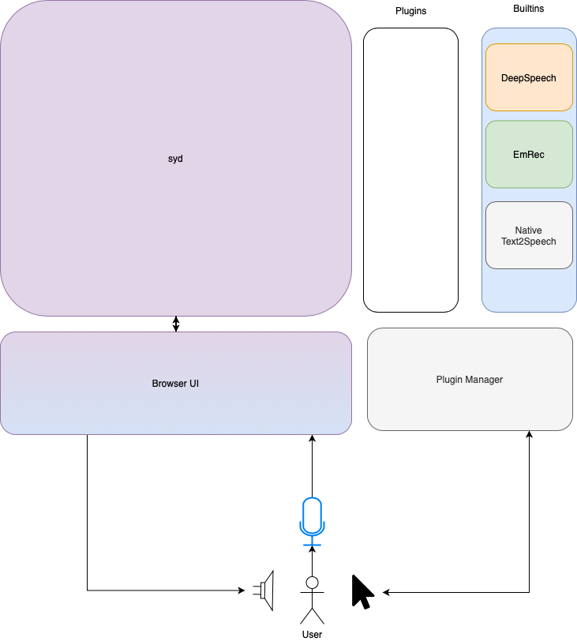

## Log: April 20 - April 26 2020

### Summary

This week was spent restructuring the project and focussing on emotion recognition.

### Genie

I've began the transition to Genie on the [development](https://github.com/madprogramer/syd/tree/development) branch.

#### Set-Up

It's easiest to run Genie, if Julia is in the PATH variable. There's a pair of unix/windows executables for launching the server quickly. So far I've only imported all of the old files from 0.0.2 back into this Genie project, but since Genie messes around with scoping I haven't been able to get it into working condition just yet.

I think that a few of the native-Julia solutions will now probably be JS based in this version (i.e. microphone input from web browser) but I'm continuing to work on it...

### New Schematic

#### Plugins

I'm dedicating a section to plugins as a placeholder for now. I will have to work on making a dedicated manager perhaps in the final couple of weeks or post-final submission.

#### Builtins

These are comprised of 3rd party libraries, hardware specific solutions and anything I've made myself, which I want to leave "easily" substitutable if a developer finds a better solution (i.e. language specific speech recognition, more accurate emotion detection etc.)

### Emotion Recognition

I'm using the [Ravdess Dataset](https://smartlaboratory.org/ravdess/) to train a emotion recognizer of my own (which I dubbed EmRec) in [Knet](https://github.com/denizyuret/Knet.jl). Most of this week was dedicated to figuring out an efficient we way to pre-process the dataset, and obtain some level of accuracy. 

Fortunately I have one ace up my sleeve, I've designed EmRec to be a sequence to sequence model, it determines the likely emotion over a set of windows over time. This will not only make word-emotion matching possible (WIP, don't expect this to come in until after the mid-demo) but also give me the ability to use a "voting" based system even if my accuracy isn't very high.

#### Model 

EmRec is a bidirectional RNN. It's input layer is a set of MFCC coefficients (first 13 coeffiecients + 13 deltas for a total of 26 features) per interval. The output layer will give an index for a recognized emotion. In the current version (unless I improve it before Wednesday) only neutral and happy responses are measured.

### What to expect next week

Seeing as how close the mid-demo is, I think I will focus on showcasing syd's "feedback" tracking ability rather than having it actively reccomend new songs. That is to say, it'll pick a set of predefined songs but display the user's emotional and verbal response in a non-use case fashion, to give an idea of what the final version will be doing under the hood.

